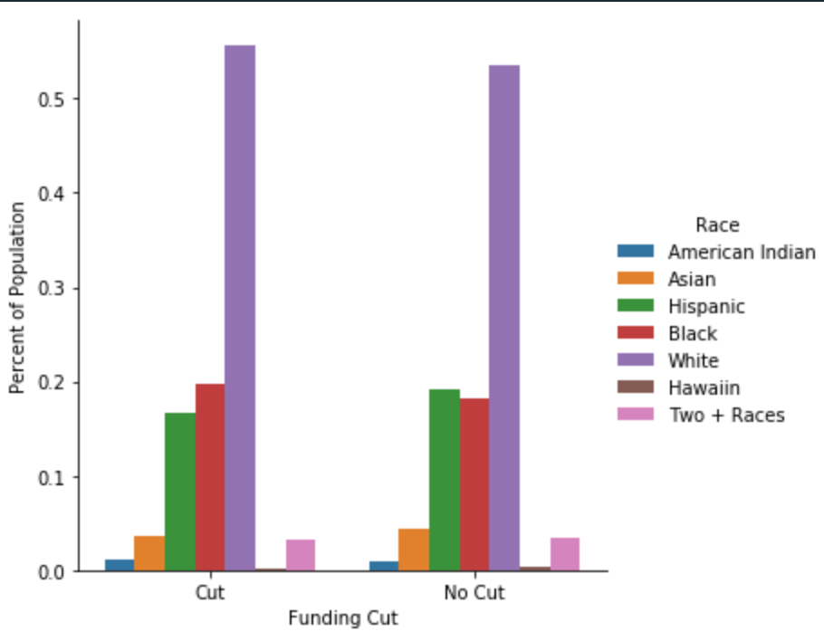
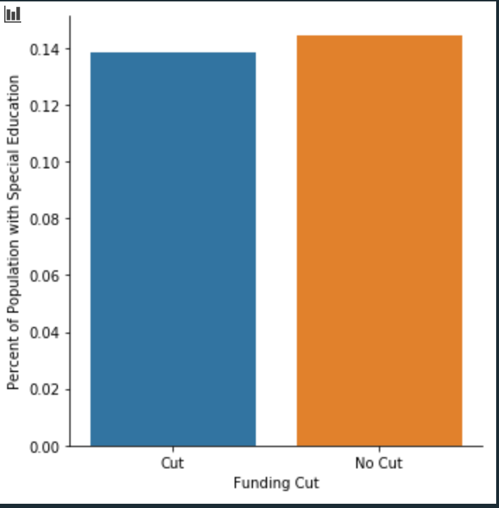

## Problem 1

For this problem, I leveraged the national math proficiency scores to identify districts for budget cuts. Becuase I leveraged a common method for determing districts budgets, each district that met the criteria for budget cuts had a common reduction in federal funding of just under *40%*. This affected about *5K* districts out of the ~16K total.

### *40% cut across high performing districts*
### *Affected ~5k districts*

## Problem 2

For this problem, I looked to evaluate any resulting bias impact of the budget cuts for districts. We want to make sure that the budget cuts that we are making across districts throughout the country do not inadverdantley impact certain races or ethnicities more than others. It can be very easy to not take into account many of the social factors that dictate the districts performance in standardized testing. The chart below plots the percent of total population of each race comparing those districts where their was budget cuts versus the districts without budget cuts. 

The chart shows that using the math standardized performanmce scoring method I used described in problem 1, the biggest impact on appears to be on districts with a higher majority of white people. The only measureable increase in percent of population of those districts that have funding cuts are for black and whites, while other races actually appear to represent less of the population within those districts with budget cuts. 

None of the changes are that drastic so it does not appear that racial bias is all that prevelant in the method chosen. I do believe though that their is many more factors that would help us ensure that this is the case. 

## Problem 3

The next potential bias we wanted to look at was the percent of students who need special education to ensure that this method does not somehow reduce funding in districts that have higher levels of special education needs, which would presumably need more funding to provide the appropriate attention needed for these students. 

The chart below shows the difference in percent of population of students needing special education.

The chart shows that their is almost no differnce in the percent of population needing special education for those districts that have funding cuts versus those that do not. 

It would be very interesting to leverage this data in the method for shifting funding around. I could imagine the percent of special education needs being an important piece of information when deciding which districts need the most funding, where you could almost add some sort of weight to the method for those districts that have the highest percentage of students that need special education given the extra cost to ensure those students get the care that they need.

## Problem 4

I choose to look the following classmates method for reducing funding for districts: https://github.com/ItsmeKumar/DS5500-HW3

This person chose to use a method that looks at each districts funding vs the districts expenses and apply a 15% cut of funding across those districts that had a positive debt value. This is actually a very interesting way of looking at this problem as it makese sense to try and add funding school districts that have higher debt and take away some funding for schools with no debt or negative debt. 

One of the things that could be of issue here is though the amount of total revenue a district may have as well as how positive or negative the debt for the district actually is. I could imagine this method being more biased towards districts with a small amount of discrentionary spending as it likely more challenging to remain debt free. The other thing this may do is not take into account historical spending. By example. if a speciic district may some captial investments in a given year to improve infrastructure, this district would get increased funding when they probably shouldnt since it was a planned debt. 

## Problem 5

I found the lecture of causal inference to be really interesting. I have not taken any course specific to causal infrerence in my coursework so this introduced me a bit more in depth to the topic. I really liked the way in which you can reframe questions to change them from a predicatable question to a causal one. I think this can be very useful when framing a problem and thinking through what the right question is to ask and whether or not machine learning can help you solve the problem.

The lecture introduced some ways to ask a problem to determine whether or not it was a problem that machine learning could solve or if their may be other way to frame the problem in a different way. I found the use of randomzied control testing to be very interesting as a way to frame the problem in what almost looks like a process map diagram. I have always found conditional probability to very interesting so I found the topic of collider bias to very interesting as is has its root in multi variable conditional probability and how two factors can collectively effect a decision. 

It seems like causual inference can be a very good topic to understand in the field of data science as I see a lot of application in the real world in companies that use controlled experiments to test out products or drugs or marketing. I think it can help frame and explain the types of questions that many people try to answer in the companies working on these types of things. 